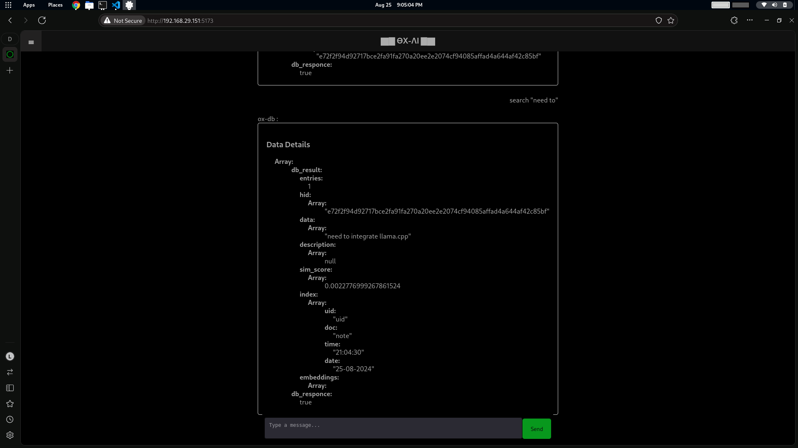
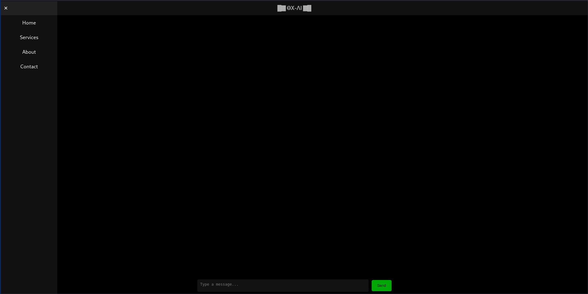
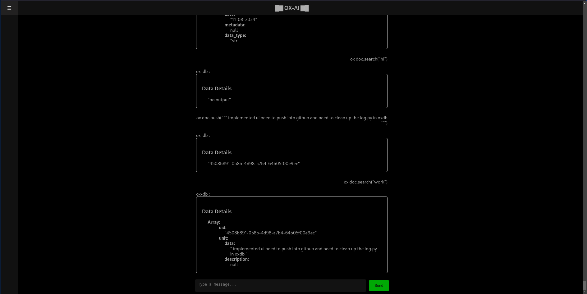

# ox-studio.ui


## installation :

```
git clone https://github.com/ox-ai/ox-studio.ui.git
cd ox-studio.ui
npm install .
```
```
npm run dev
```
```
npm run dev -- --host
```

##  db server:

### start database shell

> refere [ox-db](https://github.com/ox-ai/ox-db.git) repo for instation process

```
pip install git+https://github.com/ox-ai/ox-db.git
```

```
uvicorn ox_db.shell.log_api:app
```

## page ui :

<a  href="https://github.com/ox-ai/ox-studio.ui/blob/main/docs/assets/latest-page-2.png">
<div align="center" style="box-shadow: 0 4px 8px 0 rgba(0, 0, 0, 0.2);">

</div>
</a>

<a  href="https://github.com/ox-ai/ox-studio.ui/blob/main/docs/assets/latest-page-1.png">
<div align="center" style="box-shadow: 0 4px 8px 0 rgba(0, 0, 0, 0.2);">

</div>

<a  href="https://github.com/ox-ai/ox-studio.ui/blob/main/docs/assets/latest-page-2.png">
<div align="center" style="box-shadow: 0 4px 8px 0 rgba(0, 0, 0, 0.2);">

</div>
</a>

